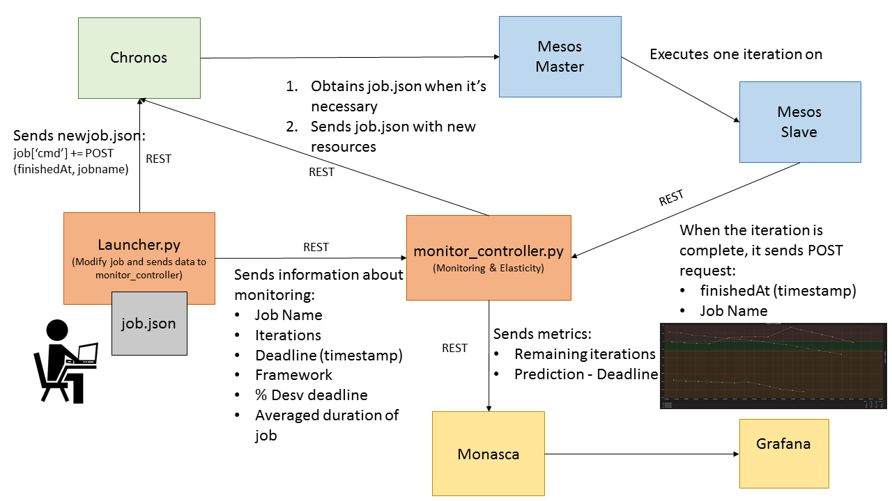

# Deployment and Monitoring Mesos Cluster

## Overview 
<p align="justify">
The main objective of this work is implements a tool that executes a <b>Dockerized Job</b> with a realistic <b>deadline</b> on frameworks for <a href="https://mesos.apache.org/">Apache Mesos</a>: <a href="https://mesos.github.io/chronos/">Chronos</a>: or <a href="https://mesosphere.github.io/marathon/">Marathon</a> (it's in development). To get this, the tool <b>varies resource allocation</b> for each job. Furthemore, we the tool sends metrics to <a href="https://wiki.openstack.org/wiki/Monasca">Monasca OpenStack</a>.
</p>

### Chronos Workflow 



## Components 

### Launcher 
<p align="justify">
The <b>Launcher</b> (launcher.py) adds a POST request to the <b>Supervisor</b> before the job ends the task. For this reason, it's <b>mandatory</b> that curl is installed in the Docker Image of job. Then, it sends the required information for the elasticity to the <b>Supervisor</b> Finally, it sends the job to the desired Mesos Framework (Chronos or Marathon). <b>Launcher</b> use online Chronos and Marathon REST clients.
</p>

Usage:
```
./laucher.py -j testlinpack.json -m credentialsMonasca.json -c credentialsChronos.json -i 'http://IP:PORT' 
```

Other parameters used: 
- <b>deadline</b>: in Local Time.
- <b>desviation_deadline</b>: percent of time interval for decrease resource allocation.
- <b>job_duration</b>: the duration in seconds of a one iteration.

This parameters are in launcher.py:
```python
if __name__ == '__main__':
	start_job = datetime.now()	
	deadline = start_job + timedelta(minutes=10) # Deadline definition
	desv_deadline = 0.05 # %/100
	job_duration = 35 # seconds

	...
```


### Supervisor
<p align="justify">
The main objetive of <b>Supervisor</b> is monitoring jobs in order to predict when all iterations for each job will be finish. If the job are finishing their iterations more faster or more slowler than it required, then it changes job's resources (CPU). To get this, it receives a request from <b>Launcher</b> with information about each job (framework, iterations, deadline, job_duration, desv_deadline, jobname) and one request when every iteration is finished for each job. <b>Supervisor</b> use all REST clients.
</p>

Usage:
```
./supervisor.py -a credentialsMarathon.json -c credentialsChronos.json -m credentialsMonasca.json -i 'IP' -p PORT
```

Other parameters used: 
- <b>logfile</b>
- <b>sleeping_time</b>: seconds between startJob(jobname) calls
- <b>cpu_max_slave</b>
- <b>cpu_min_slave</b>
- <b>cpu_increment</b>
- <b>cpu_decrement</b>

This parameters are in supervisor.py:
```python
... 

sleeping_time = 5 # CHRONOS: Between startJob calls
logfile = '/tmp/supervisor.log'
# Elasticity parameters
cpu_max_slave = 2.0
cpu_min_slave = 0.1
cpu_increment = 0.3
cpu_decrement = 0.2

	...
```

## REST APIs clients

### Manager Monasca
<p align="justify">
This module offers communication with some functionalities of Monasca OpenStack <a href="https://github.com/openstack/monasca-api/blob/master/docs/monasca-api-spec.md">REST API</a>:
</p>

- <b>delete_alarm(alarm_id)</b>: removes the alarm in Monasca.
- <b>request_token()</b>: requests a token to the Keystone Server.
- <b>send_metric(metric_name, dimensions, value, value_meta)</b>: sends metric with this parameters to Monasca.
- <b>send_metric_json(metric)</b>: sends metric (in json) to Monasca.
- <b>send_alarm(alarm_name, description, expression, severity, ok_actions, alarm_actions, undetermined_actions, match_by)</b>: sends alarm with this parameters to Monasca.
- <b>send_alarm_json(alarm)</b>: sends alarm (in json) to Monasca.
- <b>get_notification_list()</b>: obtains information of all notifications of Monasca.
- <b>get_notification(name)</b>: obtains information of the notification called "name" of Monasca.
- <b>create_notification(notification)</b>: creates a notification in Monasca.


### Manager Chronos
<p align="justify">
This module offers communication with some functionalities of Chronos <a href="https://mesos.github.io/chronos/docs/api.html">REST API</a> (Scheduler for Apache Mesos):
</p>

- <b>getInfo(jobName)</b>: obtains information of a job called "jobName".
- <b>sendJob(job)</b>: sends or updates a job (in json).
- <b>deleteJob (jobName)</b>: deletes a job called "jobName".
- <b>startJob(jobName)</b>: starts (if exists) a job called "jobName".


### Manager Marathon
<p align="justify">
This module offers communication with some functionalities of Marathon <a href="https://mesosphere.github.io/marathon/docs/rest-api.html">REST API</a> (Scheduler for Apache Mesos):
</p>

- <b>getInfo(jobName)</b>: obtains information of a job called "jobName".
- <b>sendJob(job)</b>: sends or updates a job (in json).
- <b>updateJob(jobName)</b>: updates a job (in json).
- <b>deleteJob (jobName)</b>: deletes a job called "jobName".


## Credential files
The credential files required for the correct performance of the modules described above are: 
#### Chronos
```
{
        "url" : "http://IP:4400",
        "user" : "user_chronos",
        "password" : "123456"
}
```
#### Marathon
```
{
        "url" : "http://IP:8080",
        "user" : "user_marathon",
        "password" : "123456"
}
```
#### Monasca
```
{
        "keystone_url" : "http://IP:35357/v3/",
        "monocasca_client_url" : "http://IP:8070",
        "username" : "user_monasca",
        "password" : "123456",
        "project_name" : "myproject"
}
```
